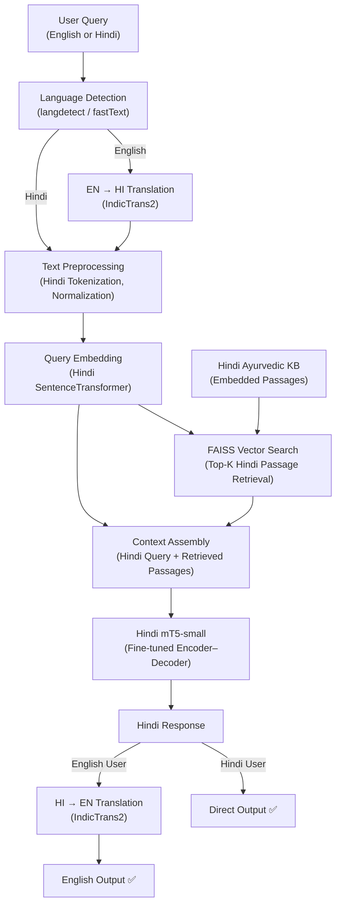
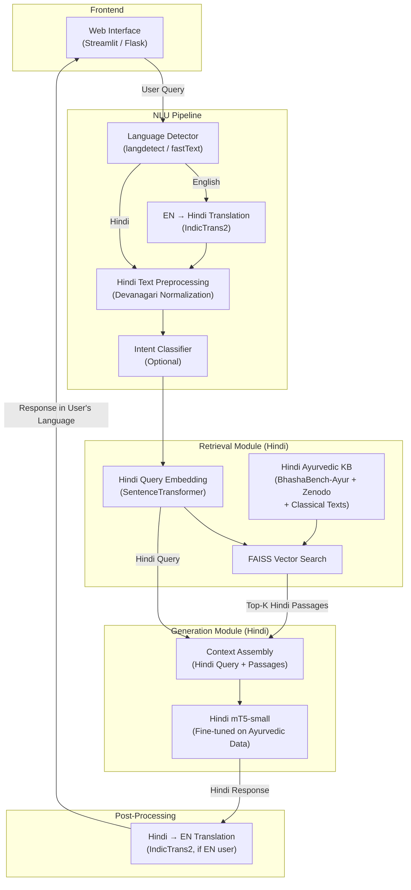

# Review 1 — Multilingual Chatbot with Ayurvedic Domain

> **Deadline:** 13.02.26 | **Deliverable:** Project Design with Documentation

---

## 1. Project Title and Domain

**Proposed Title:** Bilingual Ayurvedic Health Advisor Chatbot (Hindi-English)  
**Domain:** Conversational AI for healthcare, specifically Ayurvedic wellness and lifestyle advice. Ayurveda is a specialized traditional medical system with rich, culturally grounded knowledge; mainstream models often underperform without domain adaptation[1]. A chatbot in this domain leverages multilingual NLP to explain Ayurvedic concepts (doshas, herbs, treatments) in user-friendly Hindi and English.

---

## 2. Problem Statement / Research Motivation

Despite India's linguistic diversity, many conversational AI systems remain monolingual or narrowly specialized[2]. This creates a barrier when providing health information, especially in traditional domains like Ayurveda. Language barriers can worsen health inequities, as seen in clinical studies where limited-English-proficiency patients had poorer outcomes without multilingual support[3]. Meanwhile, rural and non-English-speaking communities often lack easy access to reliable Ayurvedic guidance.

Building a **Hindi-primary** bilingual Ayurvedic chatbot addresses these gaps: it breaks the one-language-at-a-time limitation[2], offers equitable health communication[3], and brings ancient medical wisdom to modern users. Because Ayurveda's knowledge is nuanced and culturally embedded, a dedicated system must capture domain-specific terms and reasoning[1]. Ayurvedic terminology (दोष, प्रकृति, पंचकर्म, रसायन, अश्वगंधा) exists natively in Hindi — making Hindi the natural primary language for training, with English support provided via translation.

In summary, the motivation is to enable accessible, culturally congruent health advice by combining multilingual NLP with Ayurveda's rich textual heritage, using a **Hindi-first deep learning pipeline** that serves both Hindi and English users.

---

## 3. Objectives of the Project

- **Hindi-Primary Conversational AI:** Develop a chatbot trained natively in Hindi that understands and responds to Ayurvedic queries, with English support via IndicTrans2 translation. The system handles queries and code-mixed (Hinglish) input where possible.
- **Ayurvedic Knowledge Integration:** Curate a Hindi-centric knowledge base from Ayurvedic texts (BhashaBench-Ayur, Zenodo health data, Charaka Samhita, Sushruta Samhita) and trusted health sources to feed the chatbot, ensuring factual Ayurvedic content.
- **Transformer-based NLP Model:** Fine-tune a multilingual transformer model (**mT5-small**) on the Hindi Ayurvedic dataset for answer generation using a RAG (Retrieval-Augmented Generation) pipeline[1].
- **Contextual Understanding:** Implement intent classification and dialogue management that capture Ayurvedic context (e.g. dosha types, symptoms) using cross-lingual embeddings and FAISS-based retrieval to ground responses in factual Ayurvedic content[5].
- **User Interface and Accessibility:** Provide a user-friendly chat interface (text-based via Flask/Streamlit) that can handle both Hindi and English input, catering to users with varying literacy.
- **Evaluation and Feedback:** Measure system performance with metrics like BLEU, ROUGE-L, retrieval accuracy, and human evaluation for Ayurvedic relevance. Ensure iterative improvement based on user feedback and healthcare experts' review[6][1].

---

## 4. Literature Survey / Related Work (Brief)

**Multilingual Chatbots and NLP Techniques:** Recent studies emphasize the need for multilingual bot frameworks. Kasinathan et al. propose a customizable system to deploy chatbots in multiple languages, noting that many existing services support only one language[2]. Similarly, Singh et al. build an Indian-language chatbot by fine-tuning transformer models for question-answering, avoiding heavy machine translation pipelines[4][5]. These works show that directly training on multilingual corpora (rather than translating on-the-fly) yields better performance and lower latency for Indian languages. Anastasiou et al. also highlight this for Luxembourgish, creating a manual dataset of dialog questions and using a BERT-based QA model to enable under-resourced language support[7]. Overall, the literature suggests that multilingual bots can leverage pre-trained cross-lingual embeddings and fine-tuning to understand intent across languages without full translation cycles.

**Healthcare and Under-Resourced Language Chatbots:** Healthcare is a prominent use-case for multilingual bots. Badlani et al. demonstrate a healthcare chatbot supporting English, Hindi, and Gujarati for rural India. Their system uses TF-IDF and similarity matching to diagnose based on symptoms, reporting high accuracy (~98%) and including speech-to-text to aid low-literacy users[8][9]. This shows that adding local language support drastically increases utility in underserved areas. Rainey et al. similarly find that a multilingual SMS chatbot significantly improved engagement and reduced readmissions for patients with limited English proficiency[3]. These studies motivate an Ayurvedic bot: like disease diagnosis bots, an Ayurvedic advisor should handle symptom queries and FAQs in the patient's preferred language.

**Cross-Cultural and Code-Switching Considerations:** Orosoo et al. explore enhancing NLP in multilingual bots to handle idioms and cultural context, using techniques like phonetic analysis and transfer learning (e.g. MUSE embeddings) for cross-cultural communication[6]. This is relevant because Ayurvedic terminology often carries cultural nuance (Sanskrit terms, local health beliefs). Handling code-switching (mixing Hindi and English) is also crucial. Prior work indicates that simple translation pipelines may fail for code-switched queries, and that intent models must be robust to mixed-language input[5]. Therefore, the chatbot should include a language identification layer to interpret Hinglish inputs.

**Translation vs. Transformer Models:** Classical methods rely on machine translation (MT) to map all languages into one. However, many have moved to multilingual transformers to reduce MT overhead. Singh et al. note that MT is "expensive" at run time and instead fine-tune a transformer to directly match queries in any language to knowledge-base answers[5]. Our approach adopts a **Hindi-primary** strategy: we fine-tune **mT5-small** on Hindi Ayurvedic data and use IndicTrans2 (a free, open-source translation model by AI4Bharat) to translate English inputs to Hindi before processing — requiring at most one translation step. This leverages the pre-trained multilingual understanding of mT5 while keeping the pipeline simple and culturally aligned.

Overall, related work shows that building a bilingual health chatbot involves combining multilingual NLP (fine-tuned transformers, cross-lingual embeddings) with domain-specific corpora[4][1]. Prior successes in healthcare and low-resource languages underscore the feasibility and guide the system design for an Ayurvedic chatbot.

**Research Gap:** No existing system combines **Hindi-primary model training** with **Ayurvedic domain specificity** using a **RAG pipeline with mT5** for factually grounded response generation with English support via translation.

### References

| # | Reference |
|---|-----------|
| [1] | AyurParam: A State-of-the-Art Bilingual Language Model for Ayurveda — [arxiv.org](https://arxiv.org/pdf/2511.02374) |
| [2] | Kasinathan et al. — A Customizable Multilingual Chatbot System for Customer Support (2021) |
| [3] | Rainey et al. — A Multilingual Chatbot Can Effectively Engage Arthroplasty Patients with LEP (2023) |
| [4][5] | Singh et al. — Multilingual Chatbot for Indian Languages (2023) |
| [6] | Orosoo et al. — Enhancing NLP in Multilingual Chatbots for Cross-Cultural Communication (2024) |
| [7] | Anastasiou et al. — ENRICH4ALL: A First Luxembourgish BERT Model (2022) |
| [8][9] | Badlani et al. — Multilingual Healthcare Chatbot Using Machine Learning (2021) |

---

## 5. Dataset Description

The proposed multilingual Ayurvedic chatbot relies on multiple structured and unstructured healthcare and Ayurvedic datasets to construct a Hindi-primary knowledge base.

### Primary Datasets

| Dataset | Source | Size | Languages | License |
|---------|--------|------|-----------|---------|
| **BhashaBench-Ayur (BBA)** | Hugging Face | ~15,000 MCQs (9,348 EN + 5,615 HI) | English, Hindi | CC-BY-4.0 |
| **Hindi-English Health Cases** | Zenodo | Clinical case records | Hindi, English | CC0 (Public Domain) |
| **Disease–Symptom Dataset** | Mendeley Data | 773 diseases, 377 symptoms (~246K rows) | English | CC-BY-4.0 |
| **MediTOD** | GitHub | Doctor–patient dialogues | English | Open |
| **Charaka Samhita (EN)** | WisdomLib | Full classical Ayurvedic text | English | Open |
| **Sushruta Samhita Vol.1** | WisdomLib | Sūtrasthāna translation | English | Open |
| **AI4Bharat IN22-Gen** | AI4Bharat | 1,024 parallel sentence pairs | 22 Indic languages | CC-BY-4.0 |
| **IIT Bombay EN–HI Parallel Corpus** | IITB | Large parallel corpus | English, Hindi | CC-BY-NC-4.0 |

**Dataset Roles:**
- **BhashaBench-Ayur** serves as the core QA dataset, covering diverse Ayurvedic subjects. The Hindi subset (5,615 questions) is used directly in training.
- **Hindi–English Health Cases** provides real-world medical narratives for grounding responses in clinical context.
- **Disease–Symptom Dataset** enriches symptom-based reasoning in the knowledge base.
- **MediTOD** provides conversational doctor–patient dialogues useful for dialogue-style response modeling.
- **Charaka Samhita & Sushruta Samhita** are authoritative Ayurvedic literature providing domain authenticity and traditional knowledge grounding.
- **AI4Bharat IN22-Gen & IIT Bombay Corpus** enable translation alignment and multilingual capability.

### Knowledge Base Construction (Hindi-Primary)

Since Ayurvedic terminology is naturally aligned with Hindi/Sanskrit, the chatbot is designed as a Hindi-primary system:

1. **BhashaBench-Ayur Hindi subset** (5,615 questions) — used directly
2. **BhashaBench-Ayur English subset** — translated to Hindi using IndicTrans2
3. **Classical texts** (Charaka/Sushruta) — translated excerpts to Hindi via IndicTrans2
4. **MediTOD dialogues** — translated from English to Hindi, manually verified for medical accuracy
5. **Zenodo Hindi health cases** — used directly
6. **English disease-symptom data** — translated to Hindi, manually verified
7. **Target KB size:** ~10,000–15,000 Hindi Q&A pairs + Ayurvedic passages

This ensures cultural alignment, reduced translation loss, and better semantic grounding for Ayurvedic queries.

### Sample Data Format

```
| question_hi                          | answer_hi                                          | category |
|--------------------------------------|-----------------------------------------------------|----------|
| अश्वगंधा क्या है?                    | अश्वगंधा एक अडैप्टोजेनिक जड़ी-बूटी है जो...        | herbs    |
| वात दोष को कैसे संतुलित करें?         | वात को संतुलित करने के लिए गर्म भोजन...              | doshas   |
| घुटने के दर्द का आयुर्वेदिक उपचार?   | आयुर्वेद में घुटने के दर्द के लिए महानारायण तेल...    | remedies |
```

---

## 6. Current Approach / Baseline Method

**Baseline Technique: TF-IDF + Cosine Similarity Retrieval (Hindi FAQ Matching)**

```
Hindi Query → TF-IDF Vectorization → Cosine Similarity with Hindi FAQ database → Top-k Answers
```

**Pipeline Steps:**

1. **Text Preprocessing** — Hindi tokenization, stopword removal, stemming, and Devanagari normalization
2. **Feature Extraction** — TF-IDF vectorization of Hindi text corpus
3. **Similarity Matching** — Cosine similarity between user query vector and stored FAQ vectors
4. **Response Selection** — Highest-similarity answer returned as output

**Limitations of the Baseline:**
- No semantic or contextual understanding (bag-of-words only)
- Cannot handle paraphrased or unseen Hindi queries
- No native English support
- No generative capability — restricted to stored answers only

These limitations motivate the transition toward a deep-learning-based RAG architecture.

---

## 7. Proposed Deep Learning Solution

### Architecture: **Hindi-Primary RAG Pipeline with Translation-Based English Support**

Our key design decision is to keep **Hindi as the core language** of the model. Ayurvedic terminology (दोष, प्रकृति, पंचकर्म, रसायन) exists natively in Hindi, making Hindi the natural choice. English users are served via translation (IndicTrans2). We fine-tune **mT5-small** — a multilingual transformer pre-trained on 101 languages including Hindi — on our curated Hindi Ayurvedic dataset.

### Pipeline Flow

```
┌─────────────────────────────────────────────────────────────┐
│  HINDI USER                    ENGLISH USER                 │
│  "अश्वगंधा के फायदे?"         "Benefits of Ashwagandha?"   │
│       │                              │                      │
│       │                    ┌─────────▼──────────┐           │
│       │                    │ Language Detection  │           │
│       │                    │ + EN→HI Translation │           │
│       │                    │ (IndicTrans2)       │           │
│       │                    └─────────┬──────────┘           │
│       ▼                              ▼                      │
│  ┌──────────────────────────────────────┐                   │
│  │     HINDI QUERY (Normalized)         │                   │
│  └──────────────┬───────────────────────┘                   │
│                 ▼                                            │
│  ┌──────────────────────────────────────┐                   │
│  │  SentenceTransformer (Hindi)         │                   │
│  │  Query → Dense Vector Embedding      │                   │
│  └──────────────┬───────────────────────┘                   │
│                 ▼                                            │
│  ┌──────────────────────────────────────┐                   │
│  │  FAISS Vector Search                 │                   │
│  │  → Top-K Hindi Ayurvedic Passages    │◄── Hindi KB       │
│  └──────────────┬───────────────────────┘                   │
│                 ▼                                            │
│  ┌──────────────────────────────────────┐                   │
│  │  Transformer (Hindi-tuned mT5)       │                   │
│  │  Input: Query + Retrieved Passages   │                   │
│  │  Output: Hindi Response              │                   │
│  └──────────────┬───────────────────────┘                   │
│                 ▼                                            │
│  ┌──────────────────────────────────────┐                   │
│  │  HINDI RESPONSE                      │                   │
│  │  "अश्वगंधा एक शक्तिवर्धक जड़ी..."   │                   │
│  └──────────┬───────────┬───────────────┘                   │
│             │           │                                    │
│     Hindi User    ┌─────▼──────────┐                        │
│     ← Done ✅     │ HI→EN Translate │                        │
│                   │ (if EN user)    │                        │
│                   └─────┬──────────┘                        │
│                         ▼                                    │
│                   English User ← Done ✅                     │
└─────────────────────────────────────────────────────────────┘
```

### Why Hindi-Primary?

| Advantage | Explanation |
|-----------|-------------|
| **Native Ayurvedic terms** | Terms like दोष, प्रकृति, अश्वगंधा, त्रिफला exist naturally in Hindi — no translation loss |
| **Fewer translation steps** | Max 1 translation step vs 2 in English-first approach (less error compounding) |
| **Rich Hindi datasets** | BhashaBench-Ayur has 5,615 Hindi questions; Zenodo has Hindi health cases |
| **Cultural alignment** | Ayurveda originates from Indian/Sanskrit tradition — Hindi is closer to source |
| **Simpler pipeline** | Hindi users need zero translation; only English users need 1-step translation |

### Why RAG over Pure Generative?

| Advantage | Explanation |
|-----------|-------------|
| **Factual grounding** | Answers backed by retrieved Ayurvedic passages — reduces hallucination |
| **Updatable KB** | Add new Ayurvedic content without retraining |
| **Smaller model works** | Don't need to memorize all knowledge — retrieve on demand |
| **Medical accuracy** | Critical for health domain — grounding prevents fabrication |

---

## 8. Model Architecture (High-Level)



### Component Breakdown

| Component | Technology | Details |
|-----------|-----------|---------|
| Language Detection | langdetect / fastText | Auto-detects English vs Hindi |
| Translation | IndicTrans2 (AI4Bharat, open-source) | EN → HI (input) and HI → EN (output, if needed) |
| Text Preprocessing | Hindi tokenizer | Devanagari normalization, punctuation handling |
| Query Embedding | Hindi SentenceTransformer (`paraphrase-multilingual-MiniLM-L12-v2`) | 384-dim dense vectors for Hindi semantic search |
| Vector Store | FAISS / ChromaDB | Indexed Hindi Ayurvedic KB passages, Top-K retrieval |
| Transformer | **mT5-small** (encoder–decoder) fine-tuned on Hindi Ayurvedic data | 8 encoder + 8 decoder layers, 512 hidden dim, 6-head self-attention, ~300M params |
| Decoder | Autoregressive | Token-by-token Hindi text generation with softmax output |
| Intent Classifier (optional) | Fine-tuned classification head | Cross-entropy for symptom/herb/dosha intent detection |

### mT5-small Layer Architecture

| Layer | Count | Details |
|-------|-------|---------|
| SentencePiece Tokenizer | 1 | Splits Hindi text into subword tokens (250K vocab) |
| Token Embedding | 1 | Token ID → 512-dim vector |
| Encoder Self-Attention | 8 | 6-head multi-head attention over input |
| Encoder Feed-Forward | 8 | 512 → 1024 → 512 non-linear transform |
| Decoder Masked Self-Attention | 8 | Generates tokens left-to-right |
| Decoder Cross-Attention | 8 | Decoder attends to encoder output |
| Decoder Feed-Forward | 8 | 512 → 1024 → 512 |
| Linear + Softmax | 1 | 512-dim → 250K vocab probability distribution |

---

## 9. Loss Function and Optimizer Selection

| Component | Choice | Justification |
|-----------|--------|---------------|
| **Loss Function** | Sparse Categorical Cross-Entropy | Standard for sequence generation — predicted token distribution vs ground-truth Hindi tokens; padding masked |
| **Auxiliary Loss** | Categorical Cross-Entropy | For intent classification / entity extraction heads (if used) |
| **Multi-task** | Weighted sum of losses | If combining generation + classification tasks |
| **Optimizer** | Adam (β₁=0.9, β₂=0.98, ε=1e-9) | Adaptive LR, converges well for transformers |
| **Weight Decay** | AdamW (decay = 0.01) | Prevents overfitting on limited Ayurvedic data |
| **LR Scheduler** | Inverse-square-root warmup | Warmup for 10% of steps, then decay — standard for transformer training |
| **Regularization** | Dropout (0.1–0.3) | Within transformer layers to prevent overfitting |

---

## 10. Evaluation Metrics

| Metric | What It Measures | Target |
|--------|-----------------|--------|
| **BLEU Score** | N-gram overlap between generated and reference Hindi response | ≥ 0.25 |
| **ROUGE-L** | Longest common subsequence overlap | ≥ 0.35 |
| **Perplexity** | How well the model predicts the next Hindi token | ≤ 50 |
| **Retrieval Accuracy (Top-K)** | Whether correct Hindi passage is in Top-K retrieved results | ≥ 80% |
| **Language Detection Accuracy** | Correct English vs Hindi identification | ≥ 95% |
| **Translation Quality (BLEU)** | Quality of EN↔HI translation step | ≥ 0.40 |
| **Human Evaluation** | Relevance, fluency, Ayurvedic accuracy (1–5 scale) | ≥ 3.5/5 |
| **Response Time** | End-to-end latency (query to response) | ≤ 3 seconds |

---

## 11. Scope and Limitations

### Scope

The chatbot targets general users in India seeking Ayurvedic health advice. It will support **Hindi (primary)** and English (via translation) for queries and responses. The domain includes common wellness topics (diet, lifestyle, symptom inquiry, herbal remedies) within Ayurvedic knowledge. The system will operate as a question-answer and conversational agent (text-based via Flask/Streamlit) that explains concepts in simple language. It will not attempt formal medical diagnosis or treatment planning beyond general advice, nor will it replace professional consultation.

- ✅ **Hindi-primary** model (mT5-small fine-tuned) with English support via IndicTrans2
- ✅ Ayurvedic domain Q&A (herbs, doshas, remedies, Panchakarma, diet)
- ✅ RAG-based deep learning pipeline for factually grounded responses
- ✅ FAISS-based knowledge retrieval from curated Hindi Ayurvedic KB
- ✅ Automatic language detection and EN↔HI translation
- ✅ Web-based chat interface (Flask/Streamlit)

### Limitations

- ⚠️ Accurate Ayurvedic advice requires high-quality domain data, which is currently scarce; building and verifying a robust Hindi Ayurvedic corpus is challenging.
- ⚠️ The language model may struggle with code-mixed Hinglish queries or rare dialectal usage.
- ⚠️ Pre-trained models risk factual errors or "hallucinations," especially in a specialized medical context[1], so the bot must signal uncertainty and encourage professional help.
- ⚠️ Limited to 2 languages (Hindi + English), not all 22 Indian languages.
- ⚠️ EN→HI translation quality may affect English user experience.
- ⚠️ No multi-turn conversation tracking (single Q&A per interaction).
- ⚠️ Evaluation of health chatbots is difficult, often relying on subjective user satisfaction.
- ⚠️ Ethical considerations (privacy, disclaimers, biases): the chatbot must explicitly avoid harmful recommendations and clarify it is an informational tool, not a licensed practitioner.

---

## 12. Expected Outcomes

The project is expected to deliver:

1. **A functional Hindi-primary bilingual Ayurvedic chatbot** — Supports Hindi natively and English via IndicTrans2 translation
2. **A curated Hindi Ayurvedic knowledge base** — ~10K–15K QA pairs from validated sources (BhashaBench-Ayur, Zenodo, classical texts)
3. **A RAG-based deep learning pipeline** — Hindi-tuned mT5-small achieving BLEU ≥ 0.25 and retrieval accuracy ≥ 80%
4. **High-accuracy language detection and translation** — Detection ≥ 95%, translation BLEU ≥ 0.40
5. **Web-based deployment** (Flask/Streamlit) — Interactive chatbot demo
6. **Comprehensive documentation and evaluation results** — Architecture diagrams, training logs, metric analysis

---

## 13. System Architecture Diagram



---

## Conclusion

This document establishes the complete project design for the Multilingual Ayurvedic Chatbot — covering the problem motivation, Hindi-primary data foundation, baseline retrieval methodology, proposed RAG architecture with mT5-small, evaluation framework, and expected deliverables. The Hindi-primary knowledge construction combined with measurable evaluation metrics provides a clear transition path from traditional TF-IDF retrieval to an advanced deep-learning RAG system, ensuring culturally aligned and factually grounded Ayurvedic health advice for both Hindi and English users.
